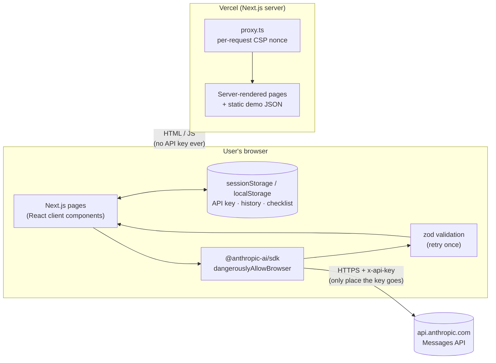

# ForwardKakis

**Your next step with AI.** ForwardKakis helps Singapore workers see how AI is likely to change their job and what to do about it. Enter a job title (or paste a job description) and you get:

- your job broken into 6–10 tasks, each marked **AI can likely handle it** (automated), **AI helps you** (augmented) or **your human strength** (human-core)
- concrete AI tool ideas for the tasks AI can help with
- 4–6 skills worth building
- a week-by-week 30-day plan you can tick off, copy or print

"Kaki" is Singlish for buddy. The tone is reassuring and practical, never alarmist.

> Independent project. Not affiliated with any organisation. AI estimates are guidance, not predictions.

---

## The problem

Most talk about AI and jobs is either hype or doom. Neither helps a retail supervisor or an accounts assistant decide what to do on Monday. People want to know three things:

1. Which parts of *my* job will change?
2. What stays human and valuable?
3. What's one small, realistic thing I can do this month?

Many workers are not tech-savvy, read on their phones, and may prefer a language other than English. ForwardKakis answers those questions in plain language, in English, 中文, Bahasa Melayu or தமிழ்.

## How it works

1. **Try a demo:** three pre-generated results (Admin Executive, Retail Supervisor, Accounts Assistant) ship as static JSON in [`data/demos/`](data/demos). They need no key and no network calls to an AI service.
2. **Analyse my job:** the user adds their own Anthropic API key, then enters a job title, plus an optional job description and years of experience. They can choose the output language, plain-language mode and the model (Claude Sonnet 5.5 by default, or Claude Haiku 5.5 for speed and lower cost).
3. **The analysis call goes straight from the browser to Anthropic.** The request uses structured outputs (`output_config.format` built from a zod schema via `zodOutputFormat`), so Claude's reply is JSON in a known shape. The app then validates it again with zod. If validation fails, it retries once, then shows a friendly error.
4. **Results:** colour-coded task cards (with icons and text labels, so colour isn't the only signal), a split bar, skills, and the 30-day checklist. Checklist state, history (last 5) and preferences live in `localStorage`. There is no database.

### Architecture



The server only serves pages. It has **no API routes**, so there is nowhere on our side for a key to be sent.

### Project layout

```
app/                 pages: landing, /analyse, /results, /history
components/          ResultView, TaskCard, SplitBar, PlanChecklist, SettingsPanel, JobForm, …
lib/schema.ts        zod schema + types (single source of truth for AI output and demos)
lib/prompt.ts        system prompt + user-message builder
lib/analyse.ts       streaming structured-output call, validation, retry, progress stages
lib/anthropic.ts     browser client, key test, friendly error mapping
lib/keyStore.ts      API key storage (session by default, opt-in local)
lib/storage.ts       try/catch wrappers for Web Storage
data/demos/          the three demo results
proxy.ts             nonce-based Content-Security-Policy
next.config.ts       other security headers
```

### Prompt design

- **System prompt** ([`lib/prompt.ts`](lib/prompt.ts)): be honest but balanced; never predict job loss; emphasise judgement, care and relationships; write for non-technical readers; keep it relevant to Singapore workplaces; mention that subsidised AI training exists in Singapore without naming any organisation, programme or price; remind users to protect personal data. It also defines the three categories precisely.
- **User message:** the job details go inside `<job_title>`, `<job_description>` and `<years_of_experience>` tags. The model is told to treat them only as information, and tag-like text is stripped from user input so it can't break out of them. The message also passes the chosen language (JSON keys and category values stay in English) and, when on, plain-language instructions.
- **Model settings:** structured output, effort `low` (fast and cheap for this task), streaming with `finalMessage()`, and progress stages detected from the streamed JSON keys.

## API key security design

ForwardKakis uses a bring-your-own-key model. Each user pays for their own usage, and the project never handles anyone's key.

| Requirement | How it's met |
|---|---|
| Key never reaches our server | The Anthropic SDK runs in the browser (`dangerouslyAllowBrowser: true`) and calls `https://api.anthropic.com` directly. There are no API routes. |
| Minimal persistence | Stored in **sessionStorage** by default (gone when the tab closes). **"Remember on this device"** is opt-in and uses localStorage. The key is only ever in one of the two. All storage access is wrapped in try/catch. |
| Easy to remove | **Clear key** removes it from both storages. The settings panel shows only a masked hint (`sk-ant-…a1b2`). |
| Never leaked by the app | Not logged (SDK `logLevel: "off"`), never in URLs, never in analytics (there are none). Error messages are written by us and never echo raw error text or request details. Password managers are hinted to ignore the field. |
| XSS hardening | A strict **nonce-based CSP** is set per request in [`proxy.ts`](proxy.ts): `script-src 'self' 'nonce-…' 'strict-dynamic'` (no `unsafe-inline`), `connect-src 'self' https://api.anthropic.com`, `object-src 'none'`, `frame-ancestors 'none'`, `base-uri 'self'`, `form-action 'self'`. No third-party scripts. Fonts are self-hosted by `next/font`. Other headers: `X-Content-Type-Options`, `Referrer-Policy: no-referrer`, `X-Frame-Options: DENY`, `Permissions-Policy`, HSTS. |
| Clear errors | Invalid key (401), rate limit (429), insufficient credit (402 / "credit balance" 400), permission (403), overloaded (5xx/529), network failure, refusal, and malformed output each get a plain-English message. |

**Trade-offs to be honest about:**
- A key in browser storage can be read by any script running on the page. The CSP is the main defence; it's also why the key defaults to sessionStorage.
- Browser extensions with page access can read it too. Users should use a key with a spending limit (set in the Anthropic Console) and revoke it when done.
- `style-src-attr 'unsafe-inline'` is allowed so React can set inline `style` attributes (used for the split-bar widths). Inline style attributes cannot run scripts.
- Nonces require every page to be rendered on each request, so pages are not statically cached at the CDN. That's fine at this scale.

## Running locally

Requirements: Node.js 20+ and npm.

```bash
npm install
npm run dev          # http://localhost:3000
```

Other scripts:

```bash
npm run lint
npx tsc --noEmit
npm run build && npm start
```

No environment variables are needed. Demo mode works immediately. For live analysis, open **Settings** in the app and paste an Anthropic API key from [console.anthropic.com](https://console.anthropic.com).

## Deploying

This is a standard Next.js app on Vercel: import the GitHub repo in the Vercel dashboard with the default settings. No environment variables are required.

## Limitations

- **Estimates, not predictions.** Results come from a language model's general knowledge. They aren't based on labour-market data, and two runs can differ.
- **Bring your own key.** Live analysis needs an Anthropic account with credit. Visitors without one can only use the demos.
- **Browser-only storage.** History (last 5), checklist progress and the remembered key live in one browser and don't sync across devices. Clearing site data removes them.
- **English UI.** Analysis output can be in English, 中文, Bahasa Melayu or தமிழ், but interface labels are English-only for the MVP.
- **Category enforcement.** The API's structured-output mode doesn't enforce every constraint (array lengths, enum values). These are passed to the model as hints and enforced by zod afterwards, with one retry.
- **No accounts, no server analytics, no database,** by design for the MVP.

## Roadmap

- Team view for managers: up to 5 roles, with job-redesign suggestions that keep people in meaningful roles.
- Translated UI labels.
- Export to calendar reminders for the 30-day plan.
